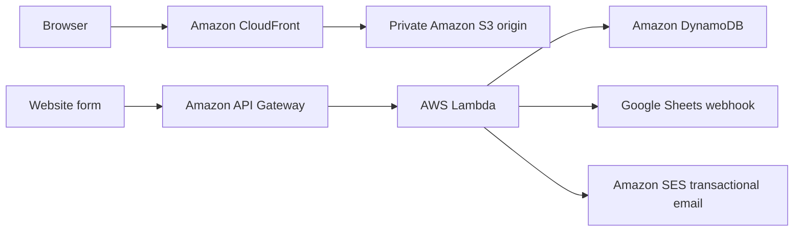

# Fenton4Fitness Production Website

[Fenton4Fitness](https://fenton4fitness.com) is a production, mobile-responsive
coaching website for youth athletes, teams, and adult personal-training
clients. It is also a cloud-engineering portfolio project demonstrating secure
static hosting, edge delivery, serverless lead capture, third-party automation,
and infrastructure as code.

## Production milestone

Production launched on **July 27, 2026** at:

**https://fenton4fitness.com**

The apex domain is canonical. HTTP requests upgrade to HTTPS, and `www`
requests redirect to the apex while preserving paths and query strings.

## Architecture



Porkbun remains the registrar and authoritative DNS provider. An ACM
certificate in `us-east-1` provides HTTPS for the apex and `www` hostnames.
CloudFront serves the private S3 origin through Origin Access Control; direct
S3 website and object requests are blocked.

## Frontend

- Semantic multi-page HTML
- Shared responsive CSS with mobile navigation
- Dependency-free JavaScript
- Accessible labels, focus states, status messages, and keyboard navigation
- Unique page titles and descriptions
- Responsive WebP coaching photography
- `robots.txt`, `sitemap.xml`, canonical URLs, and structured metadata
- Centralized content, pricing, and API configuration

Deployable assets live in `website-files/`.

## Lead forms

All forms use the public API Gateway endpoint configured in
`website-files/config.js`. That endpoint is intentionally public and contains
no credential. Lambda-side table, email, origin, and webhook settings remain in
AWS configuration.

Six submission categories are supported:

| Submission | `submissionType` | `leadType` |
|---|---|---|
| Youth athlete | `lead` | `youth-athlete` |
| Adult training | `lead` | `adult-personal-training` |
| Team training | `lead` | `team-training` |
| General inquiry | `lead` | `general-inquiry` |
| Business website inquiry | `website-service-inquiry` | `business-website` |
| Testimonial | `testimonial` | `testimonial` |

Testimonials are stored for private review and are never published
automatically.

## Production controls

- API Gateway CORS is restricted to approved production and development origins.
- The API stage uses request throttling.
- Lambda validates input and isolates optional downstream failures.
- DynamoDB point-in-time recovery is enabled.
- CloudFront adds HSTS, clickjacking protection, MIME-sniffing protection, and
  a strict referrer policy.
- HTML, configuration, sitemap, and robots files revalidate immediately.
- Versioned CSS, JavaScript, and images use long-lived immutable caching.
- S3 versioning and server-side encryption are enabled.

## Local development

```powershell
python -m http.server 8000 --directory website-files
```

Open `http://localhost:8000/`. Localhost must remain in the approved API CORS
configuration for form testing.

## Deployment

The Project 05 Terraform configuration discovers and uploads every file under
`website-files/`.

```powershell
cd ..\project-05-terraform-f4f-infrastructure\terraform
terraform init
terraform fmt -check -recursive
terraform validate
terraform plan
terraform apply
```

CloudFront invalidation is normally unnecessary for versioned assets. Create a
targeted invalidation only when an urgent HTML or configuration change must
bypass cached edge content.

## Maintenance

1. Update shared business content and pricing in `website-files/site-data.js`.
2. Keep API configuration centralized in `website-files/config.js`.
3. Run local link, HTML, JavaScript, accessibility, and responsive checks.
4. Review `terraform plan` before every deployment.
5. Test each form with synthetic data clearly labeled safe to delete.
6. Confirm DynamoDB storage and each configured downstream delivery.
7. Never place credentials, Lambda environment values, webhook URLs, personal
   form submissions, or Terraform state in this repository.

## Related projects

- `project-04-f4f-lead-capture-system` — serverless form-processing backend
- `project-05-terraform-f4f-infrastructure` — S3, CloudFront, ACM, and deployment
  infrastructure
